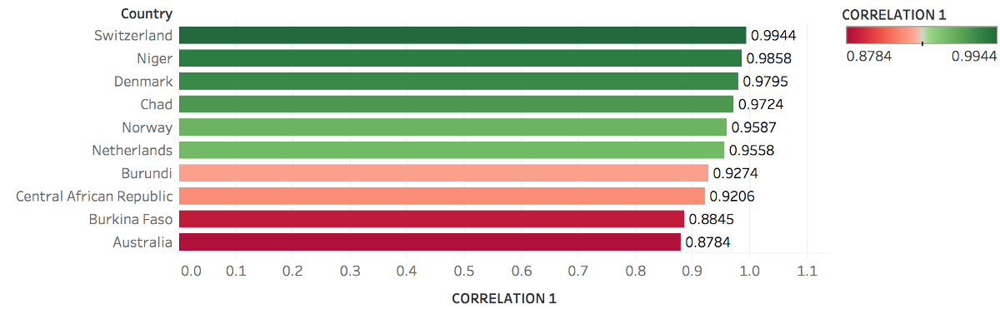

# The relationship between HDI, Education and Gender: An Analysis around the World
## Udacity Bertelsmann Data Science Schoolarship — BUDS Challenge MINI Project

By [Mayra Bueno](https://github.com/baguy/) and [Steve Getachew](https://github.com/SteveGetachew)

As part of the MINI Project initiative in Data Science Scholarship provided by Udacity in collaboration with Bertelsmann, a team of two brave aspiring data scientists (Mayra Dantas Bueno & Steve Getachew) decided to set out and tasked themselves with the project of analysing a rather ambitious topic: How is the development status of countries affected by their education and what other factors might contribute to this result?

For this matter, we gathered data from the publicly available UN Data set and propose to examine the relationship between the development status of a country (as measured by the Human Development Index) and the education standards of said countries, as described more specifically by such variables as Expected Years of Schooling and (Actual) Mean Years of Schooling for the respective countries. In order to be able to use the data, it was necessary to clean the files and data provided. Columns that were filled with null values for instance were deleted and other columns also had to be renamed. Also in few cases, some countries lacked data partially or entirely for various reasons, so that it was decided to not include those countries in the analysis in order to reduce the impact of the analysis. Tools utilised by the group include Tableau for Data Exploration and Data Visualisation and Python in connection with the Jupyter Notebook for Data Analysis and Data Visualisation.

For an initial visualization to gain an insight into the data, we looked at the average HDI score (across all years of the data set from 1990 to 2015) across countries which provides us with the following distribution of HDI scores around the world.

###### Initial Mapping of HDI across the World — Data averaged from 1990–2015

Before carrying on with the analysis, we decided to narrow down our dataset for the scope of our analysis in order to examine the relationship between Education and the HDI for respective countries more effectively. For this matter, we decided to look at two groups of countries, the ones with the highest average HDI and the lowest HDI across the years, settling on a manageable number of 5 countries per group.

###### Initial Mapping of HDI across the World — Data averaged from 1990–2015

After doing so, we decided to look more into the relationship between the HDI Score and how it is influenced by the aspect of Education, which in our case more specifically refers to the two main factors Expected Years of Education and Actual Mean Years of Education in a respective country.

To begin with, we look into how strong the relationship between those factors is by looking at a simple correlation for the two groups of countries identified above. In fact, we can see that for the HDI score and Expected Years of Schooling as well as HDI score and Mean Years of Schooling, the correlation seems to be generally quite strong for both groups of countries so that one can assume there to be a strong relationship between the two variables.

###### Correlation between HDI Score & (Actual) Mean Years of Education (Average 1990–2015)

###### Correlation between HDI Score & Expected Years of Education (Average 1990–2015)

Interestingly we can see that for countries with a lower HDI score, the correlation between HDI & Expected Years of Education seems to be even stronger than for countries with a higher HDI score (as demonstrated by the fact that the Top 4 of the Top 5 countries in this analysis are actually from the group of countries with lower HDI scores). However, when compared to the prior analysis of correlation between HDI & Actual Mean Years of Education we can see that this picture is very much reversed, seeing as now 3 Countries in the Top 5 are from the group of countries with the highest HDI. This possibly indicates that there might be a discrepancy between the Expected Years of Education and the Mean Years of Education between countries. This discrepancy could be especially severe for developing countries with a lower HDI score which could help to explain this difference in correlation (for instance that Actual Years of Education is much lower than Expected Education or that there are other factors leading to a shift away from the expectation in education for countries with a lower HDI Score.

Afterwards, we took a look at the mean years of education for males and females from the five countries with the highest Human Development Index and Gender Development Index and the five countries with the lowest scores to determine if there is also a difference in education between gender. (The available data was last updated in 2015).

In fact, it is possible to see from the charts below that countries with a higher HDI score seem to have a more egalitarian education for both genders. Countries with lower HDI scores on the other hand, seem to not only have lesser mean education in general (as shown by an overall lower amount of years of education) but also show an especially severe contrast in education between the genders, especially concerning women who barely receive education at all.

###### Correlation between mean years of schooling for females and males in top 5 countries with highest GDI

")
###### The same (from the previous image) in top 5 countries with lowest GDI (2015)

Finally, a comparison was made between the country with the highest Human Development Index in the world, Norway, and the country with the lowest Human Development Country, Niger. Besides HDI, we also compared gross national income and mean years of schooling to gain a better insight into how this discrepancy in HDI can help to explain or result in other differences in variables between the countries.

###### Comparison between Norway’s HDI with Niger’s HDI

###### Comparison between Norway’s mean years of schooling with Niger’s

###### The same (from the previous image) with Norway’s gross national income per capita as compared to Niger’s

To compare the mean years of schooling, it was necessary to calculate the means for female and male income (the data presented both values separated), and the same had to be done for the gross national per capita since it was also separated between male and female incomes.

This seems to indicate that countries committed with education for both males and females tend to have higher income. A possible explanation for that might be that people with longer education (as measured by mean years of schooling) and/or possibly better education usually, obtain better jobs with higher pay, which can improve the quality of life in the country and therefore ultimately also contributes to the living standard and HDI of the respective countries.

This theory also seems to be confirmed by empirical research and academia, as many studies indicate that better education usually results in higher individual income and higher social capital and long-term economic growth for an overall economy. Moreover, more recent studies have also argued that there is in fact a positive link between schooling levels and the economic growth of a country therefore directly contradicting earlier research that relied on less sophisticated data.

Indeed, it is assumed that better education does not only lead to higher individual income but is also a necessary (although possibly not sufficient) precondition for long-term economic growth (Lutz W. et al., 2008). Therefore, as shown in this project, education can be a useful variable to help explain differences between countries as measured by HDI. However, one should not assume that it is the only possible factor as there might be other relevant variables that are however out of the scope of this analysis and should therefore be considered by further research.

Thank you very much for your interest and we hope that our analysis was of interest to you! Should you have any remarks please don’t hesitate to get in contact with us! :)

## References
- Lutz, W., Creso Cuaresma, J., & Sanderson, W. (2008). The demography of educational attainment and economic growth. Available online [here](http://science.sciencemag.org/content/319/5866/1047).

- Roser, M., Ortiz-Ospina, E. (2018). Global Rise of Education. Available online [here](https://ourworldindata.org/global-rise-of-education#note-34).

- United Nations. Human Development Reports. Human Development Index. Available [here](hdr.undp.org/en/data#).

- United Nations. Human Development Indices: A statistical update 2015. Gender Development Index. Available [here](data.un.org/DocumentData.aspx?id=380).
